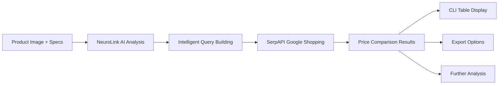

# Competitive Analysis Tool

A comprehensive AI-powered competitor analysis tool that leverages multimodal AI and web search capabilities to analyze product images, extract features, and identify competitive pricing across online marketplaces. Transform static product data into actionable competitive intelligence through automated analysis and comparison.

## Overview

The Competitive Analysis Tool harnesses NeuroLink's multimodal AI capabilities and SerpAPI's web search integration to deliver comprehensive competitor intelligence:

1. **Analyzes** product images using NeuroLink AI to extract product names and features
2. **Builds** intelligent search queries by combining user input with AI-extracted information
3. **Searches** for product prices across Indian e-commerce marketplaces using SerpAPI (Google Shopping)
4. **Displays** comprehensive price comparison results in formatted CLI tables with ₹ currency formatting



## What You Get

- **Multimodal AI analysis** – Extract product features and names from images using Gemini 2.5 Flash
- **Intelligent query building** – Combine user specifications with AI insights for optimal search results
- **Comprehensive price comparison** – Search across Indian e-commerce sites (Amazon, Flipkart, Croma, etc.)
- **CLI table output** – Professional formatted tables with Indian Rupee pricing
- **Flexible input options** – Support for product names, specifications, and image analysis
- **Export capabilities** – Results formatted for easy integration with other tools

## Supported Providers & Models

### AI Provider Compatibility

| Provider    | Model           | Capabilities              | Rate Limit    | Regional Availability |
| ----------- | --------------- | ------------------------- | ------------- | --------------------- |
| `google-ai` | `gemini-2.5-flash` | Image analysis, text generation | 10/min       | Global                |

### Search Provider Compatibility

| Provider | Capabilities                  | Rate Limit | Regional Availability |
| -------- | ----------------------------- | ---------- | --------------------- |
| `serpapi` | Google Shopping search, Indian marketplaces | 250/month free | Global |

> **Note:** SerpAPI requires API key configuration. NeuroLink uses Google AI Gemini models for image analysis.

### Key Features & Capabilities

| Feature              | Description                     | Input Requirements | Output Format |
| -------------------- | ------------------------------- | ------------------ | ------------- |
| Image Analysis       | Extract product names from images | JPEG/PNG/WebP files | Text analysis |
| Query Building       | Smart search query construction | User specs + AI analysis | Search strings |
| Price Search         | E-commerce marketplace scanning | Product queries | Price data arrays |
| Results Display      | Formatted CLI tables           | Price comparison data | Console tables |

## Prerequisites

1. **NeuroLink SDK** with Google AI access
2. **SerpAPI account** with Google Shopping enabled
3. **Node.js** >= 18.0.0 for runtime
4. **Product images** in JPEG, PNG, or WebP format (max 10MB)
5. **Google AI API key** configured for image analysis

## Quick Start

### SDK Usage

```typescript
import { findProductFeatures } from "./find-product.ts";
import { searchProductPrices, displayTable } from "./search-product.ts";

// Basic product analysis and price comparison
const result = await findProductFeatures({
  productName: "IQOO neo 10r",
  productModel: "",
  specification: "12 + 256",
  images: ["./product-image.jpg"]
});

if (result.success) {
  const prices = await searchProductPrices(result.searchQuery);
  displayTable(prices);
}
```

#### With Full Configuration

```typescript
import { findProductFeatures } from "./find-product.ts";
import { searchProductPrices, displayTable } from "./search-product.ts";

// Comprehensive analysis with all options
const analysisResult = await findProductFeatures({
  productName: "Samsung Galaxy S24",
  productModel: "Ultra",
  specification: "512GB Storage",
  images: ["./s24-ultra.jpg"],
  config: {
    provider: "google-ai",
    model: "gemini-2.5-flash"
  }
});

if (analysisResult.success) {
  const priceResults = await searchProductPrices(analysisResult.searchQuery);

  console.log("Search Query:", analysisResult.searchQuery);
  console.log("Metadata:", analysisResult.metadata);
  displayTable(priceResults);
}
```

#### Image-Only Analysis

```typescript
import { findProductFeatures } from "./find-product.ts";
import { searchProductPrices, displayTable } from "./search-product.ts";

// Analyze product from image only
const imageAnalysis = await findProductFeatures({
  images: ["./unknown-product.jpg"]
});

if (imageAnalysis.success) {
  const prices = await searchProductPrices(imageAnalysis.searchQuery);
  displayTable(prices);
}
```

### CLI Usage

```bash
# Basic product analysis and price search
npx tsx main.ts

# Expected output:
🚀 Product Search & Price Comparison Demo

🔍 Step 1: Building product search query...
✅ Search Query: IQOO neo 10r 12 256
📊 Metadata: { userText: 'IQOO neo 10r 12 256', ... }

🛒 Step 2: Searching for product prices online...
[...search results...]

📊 Step 3: Formatted Price Comparison Table:
E-Commerce Name                 | Price          | Title
Amazon                         | ₹24,999        | IQOO Neo 10R (12GB RAM, 256GB Storage)
Flipkart                       | ₹24,999        | IQOO Neo 10R 5G (12GB RAM, 256GB)
Croma                          | ₹24,990        | IQOO Neo 10R 5G Smartphone
```

### CLI Arguments

| Argument          | Type    | Default | Description                          |
| ----------------- | ------- | ------- | ------------------------------------ |
| `--product-name`  | string  | -       | Product name for analysis            |
| `--model`         | string  | -       | Product model/variant                |
| `--specs`         | string  | -       | Product specifications               |
| `--image`         | string  | -       | Path to product image file           |
| `--output-format` | string  | table   | Output format (table/json)           |

## Comprehensive Examples

### Example 1: Smartphone Analysis

```typescript
import { findProductFeatures } from "./find-product.ts";
import { searchProductPrices, displayTable } from "./search-product.ts";

async function analyzeSmartphone() {
  // Analyze flagship smartphone
  const analysis = await findProductFeatures({
    productName: "iPhone 15 Pro Max",
    productModel: "",
    specification: "256GB Natural Titanium",
    images: ["./iphone-15-pro-max.jpg"]
  });

  if (analysis.success) {
    const prices = await searchProductPrices(analysis.searchQuery);

    console.log("📱 Smartphone Analysis Complete");
    console.log(`🔍 Search Query: ${analysis.searchQuery}`);
    console.log(`📊 Found ${prices.length} price points`);

    displayTable(prices);
  }
}
```

### Example 2: Batch Product Analysis

```typescript
import { findProductFeatures } from "./find-product.ts";
import { searchProductPrices, displayTable } from "./search-product.ts";
import { readdir } from "fs/promises";
import path from "path";

async function batchAnalysis(imageDir: string) {
  const imageFiles = await readdir(imageDir);
  const results = [];

  for (const imageFile of imageFiles) {
    if (path.extname(imageFile).match(/\.(jpg|jpeg|png|webp)$/i)) {
      try {
        const analysis = await findProductFeatures({
          images: [path.join(imageDir, imageFile)]
        });

        if (analysis.success) {
          const prices = await searchProductPrices(analysis.searchQuery);

          results.push({
            image: imageFile,
            searchQuery: analysis.searchQuery,
            priceCount: prices.length,
            success: true
          });
        }
      } catch (error) {
        results.push({
          image: imageFile,
          error: error instanceof Error ? error.message : "Unknown error",
          success: false
        });
      }
    }
  }

  console.table(results);
  return results;
}

// Usage
const batchResults = await batchAnalysis("./product-images");
```

### Example 3: Custom Product Analyzer Class

```typescript
import { findProductFeatures } from "./find-product.ts";
import { searchProductPrices, displayTable } from "./search-product.ts";

class ProductAnalyzer {
  async analyze(options: {
    name?: string;
    model?: string;
    specs?: string;
    imagePath?: string;
  }) {
    const analysisOptions: any = {};

    if (options.name) analysisOptions.productName = options.name;
    if (options.model) analysisOptions.productModel = options.model;
    if (options.specs) analysisOptions.specification = options.specs;
    if (options.imagePath) analysisOptions.images = [options.imagePath];

    const result = await findProductFeatures(analysisOptions);

    if (!result.success) {
      throw new Error(result.error);
    }

    const prices = await searchProductPrices(result.searchQuery);

    return {
      searchQuery: result.searchQuery,
      metadata: result.metadata,
      prices,
      analysis: result
    };
  }

  async compareProducts(products: Array<{
    name: string;
    imagePath: string;
  }>) {
    const comparisons = [];

    for (const product of products) {
      const result = await this.analyze({
        name: product.name,
        imagePath: product.imagePath
      });

      comparisons.push({
        product: product.name,
        searchQuery: result.searchQuery,
        priceCount: result.prices.length,
        averagePrice: this.calculateAveragePrice(result.prices)
      });
    }

    return comparisons;
  }

  private calculateAveragePrice(prices: any[]) {
    const validPrices = prices.filter(p => p.extracted_price > 0);
    if (validPrices.length === 0) return 0;

    const sum = validPrices.reduce((acc, p) => acc + p.extracted_price, 0);
    return Math.round(sum / validPrices.length);
  }
}

// Usage
const analyzer = new ProductAnalyzer();

// Single product analysis
const singleResult = await analyzer.analyze({
  name: "MacBook Air M3",
  specs: "13-inch 256GB",
  imagePath: "./macbook-air.jpg"
});

displayTable(singleResult.prices);

// Multi-product comparison
const comparisonResults = await analyzer.compareProducts([
  { name: "Dell XPS 13", imagePath: "./dell-xps.jpg" },
  { name: "HP Spectre x360", imagePath: "./hp-spectre.jpg" },
  { name: "Lenovo ThinkPad X1", imagePath: "./thinkpad-x1.jpg" }
]);

console.table(comparisonResults);
```


```typescript
import { findProductFeatures } from "./find-product.ts";
import { searchProductPrices } from "./search-product.ts";
import { writeFile } from "fs/promises";

class CompetitiveIntelligence {
  async generateReport(productName: string, imagePath: string) {
    // Analyze product
    const analysis = await findProductFeatures({
      productName,
      images: [imagePath]
    });

    if (!analysis.success) {
      throw new Error(analysis.error);
    }

    // Get pricing data
    const prices = await searchProductPrices(analysis.searchQuery);

    // Generate competitive intelligence report
    const report = {
      product: productName,
      analysisDate: new Date().toISOString(),
      searchQuery: analysis.searchQuery,
      metadata: analysis.metadata,
      pricing: {
        totalResults: prices.length,
        priceRange: this.getPriceRange(prices),
        averagePrice: this.getAveragePrice(prices),
        competitors: this.extractCompetitors(prices)
      },
      recommendations: this.generateRecommendations(prices)
    };

    // Export to JSON
    await writeFile(
      `./reports/${productName.replace(/\s+/g, '_')}_analysis.json`,
      JSON.stringify(report, null, 2)
    );

    return report;
  }

  private getPriceRange(prices: any[]) {
    const validPrices = prices.filter(p => p.extracted_price > 0);
    if (validPrices.length === 0) return { min: 0, max: 0 };

    const prices_sorted = validPrices.sort((a, b) => a.extracted_price - b.extracted_price);
    return {
      min: prices_sorted[0].extracted_price,
      max: prices_sorted[prices_sorted.length - 1].extracted_price
    };
  }

  private getAveragePrice(prices: any[]) {
    const validPrices = prices.filter(p => p.extracted_price > 0);
    if (validPrices.length === 0) return 0;

    return Math.round(
      validPrices.reduce((sum, p) => sum + p.extracted_price, 0) / validPrices.length
    );
  }

  private extractCompetitors(prices: any[]) {
    return prices.map(p => ({
      seller: p.source,
      price: p.extracted_price,
      title: p.title
    }));
  }

  private generateRecommendations(prices: any[]) {
    const avgPrice = this.getAveragePrice(prices);
    const recommendations = [];

    if (prices.length === 0) {
      recommendations.push("No competitive pricing data found");
    } else if (prices.length < 3) {
      recommendations.push("Limited competition - potential pricing flexibility");
    } else {
      recommendations.push(`Market average price: ₹${avgPrice.toLocaleString('en-IN')}`);
      recommendations.push("Consider competitive positioning strategy");
    }

    return recommendations;
  }
}

// Usage
const ci = new CompetitiveIntelligence();
const report = await ci.generateReport("Sony WH-1000XM5", "./sony-headphones.jpg");
console.log("Competitive Intelligence Report Generated:", report);
```
### Example 4: Error Handling & Resilience

```typescript
import { findProductFeatures } from "./find-product.ts";
import { searchProductPrices, displayTable } from "./search-product.ts";

class ResilientAnalyzer {
  async analyzeWithRetry(options: any, maxRetries = 3) {
    let lastError: Error | null = null;

    for (let attempt = 1; attempt <= maxRetries; attempt++) {
      try {
        const result = await findProductFeatures(options);

        if (result.success) {
          return result;
        }

        // If analysis failed but didn't throw, wait and retry
        if (attempt < maxRetries) {
          await this.delay(1000 * attempt);
          continue;
        }

        throw new Error(result.error || "Analysis failed");

      } catch (error) {
        lastError = error as Error;

        // Retry on network errors
        if (this.isRetryableError(error) && attempt < maxRetries) {
          console.log(`Attempt ${attempt} failed, retrying...`);
          await this.delay(2000 * attempt);
          continue;
        }

        break;
      }
    }

    throw lastError || new Error("Max retries exceeded");
  }

  async getPricesWithFallback(searchQuery: string) {
    try {
      return await searchProductPrices(searchQuery);
    } catch (error) {
      console.warn("Primary search failed, trying simplified query");

      // Fallback: try with simplified query
      const simplifiedQuery = searchQuery.split(' ').slice(0, 3).join(' ');
      return await searchProductPrices(simplifiedQuery);
    }
  }

  private isRetryableError(error: any): boolean {
    const retryableMessages = [
      'timeout',
      'network',
      'connection',
      'rate limit',
      'temporary'
    ];

    const errorMessage = error.message?.toLowerCase() || '';
    return retryableMessages.some(msg => errorMessage.includes(msg));
  }

  private delay(ms: number): Promise<void> {
    return new Promise(resolve => setTimeout(resolve, ms));
  }

  async comprehensiveAnalysis(options: any) {
    try {
      // Step 1: Analyze product with retry logic
      const analysis = await this.analyzeWithRetry(options);

      // Step 2: Get pricing with fallback
      const prices = await this.getPricesWithFallback(analysis.searchQuery);

      return {
        analysis,
        prices,
        success: true
      };

    } catch (error) {
      return {
        error: error instanceof Error ? error.message : "Unknown error",
        success: false
      };
    }
  }
}

// Usage
const resilientAnalyzer = new ResilientAnalyzer();

const result = await resilientAnalyzer.comprehensiveAnalysis({
  productName: "Nike Air Max",
  specification: "Size 10",
  images: ["./nike-air-max.jpg"]
});

if (result.success) {
  displayTable(result.prices);
} else {
  console.error("Analysis failed:", result.error);
}
```

## Type Definitions

### ProductAnalysisInput

Input options for product analysis:

```typescript
type ProductAnalysisInput = {
  productName?: string;      // User-provided product name
  productModel?: string;     // Product model/variant
  specification?: string;    // Technical specifications
  images?: string[];         // Array of image file paths
  config?: {                  // Optional AI configuration
    provider?: string;
    model?: string;
  };
};
```

### ProductAnalysisResult

Result structure from product analysis:

```typescript
type ProductAnalysisResult = {
  success: boolean;
  searchQuery?: string;
  error?: string;
  metadata: {
    provider?: string;
    model?: string;
    userText?: string;
    imageProductName?: string;
    imageCount?: number;
    timestamp: string;
  };
};
```

### ShoppingResult

Individual shopping result structure:

```typescript
type ShoppingResult = {
  position: number;
  title: string;
  link: string;
  source: string;        // E-commerce platform (Amazon, Flipkart, etc.)
  price: string;         // Formatted price string
  extracted_price: number; // Numeric price value
  rating?: number;
  reviews?: number;
  thumbnail?: string;
};
```

## Configuration & Best Practices

### Configuration Options

| Option               | Type    | Default        | Description                              |
| -------------------- | ------- | -------------- | ---------------------------------------- |
| `productName`        | string  | -              | Product name from user input             |
| `productModel`       | string  | -              | Product model or variant                 |
| `specification`      | string  | -              | Technical specifications                 |
| `images`             | string[]| -              | Array of image file paths                |
| `config.provider`    | string  | "google-ai"    | AI provider for analysis                 |
| `config.model`       | string  | "gemini-2.5-flash" | AI model for image analysis              |

### Analysis Quality Settings

```typescript
// High precision analysis for flagship products
const flagshipAnalysis = await findProductFeatures({
  productName: "iPhone 15 Pro Max",
  productModel: "256GB",
  specification: "Natural Titanium",
  images: ["./iphone-hero.jpg"],
  config: {
    provider: "google-ai",
    model: "gemini-2.5-flash"
  }
});

// Quick analysis for bulk processing
const bulkAnalysis = await findProductFeatures({
  images: ["./product-image.jpg"]
});
```

### Best Practices

#### 1. Input Optimization

```typescript
// ❌ Vague product information
const vagueInput = {
  productName: "Phone",
  specification: "Good"
};

// ✅ Specific and detailed
const detailedInput = {
  productName: "Samsung Galaxy S24 Ultra",
  productModel: "512GB Titanium Black",
  specification: "SM-S928B 12GB RAM S Pen",
  images: ["./s24-ultra-front.jpg", "./s24-ultra-back.jpg"]
};
```

**Input Quality Guidelines:**

| Input Type     | Example                                      | Expected Results |
| -------------- | -------------------------------------------- | ---------------- |
| Product Name   | "Samsung Galaxy S24 Ultra 512GB"             | Precise matches  |
| Specifications | "SM-S928B 12GB RAM 512GB Storage S Pen"      | Technical matches |
| Images         | product photos                      | Accurate AI analysis |

#### 2. Image Preparation

```typescript
// Image requirements for optimal analysis
const imageRequirements = {
  minResolution: "640x480",     // Minimum size for analysis
  recommendedResolution: "1920x1080", // Best results
  formats: ["JPEG", "PNG", "WebP"],
  maxSize: "10MB",
  content: "Clear product visibility, minimal background clutter"
};

// Preprocessing recommendations
import sharp from "sharp";

async function prepareProductImage(inputPath: string) {
  return sharp(inputPath)
    .resize(1920, 1080, {
      fit: "inside",
      withoutEnlargement: true
    })
    .jpeg({ quality: 90 })
    .toBuffer();
}
```

#### 3. Performance Optimization

```typescript
// Batch processing with concurrency control
import pLimit from "p-limit";

const limit = pLimit(5); // Limit concurrent analyses

const products = [
  { name: "iPhone 15", image: "./iphone.jpg" },
  { name: "Samsung S24", image: "./samsung.jpg" },
  { name: "Google Pixel 8", image: "./pixel.jpg" }
];

const results = await Promise.all(
  products.map(product =>
    limit(async () => {
      const analysis = await findProductFeatures({
        productName: product.name,
        images: [product.image]
      });

      if (analysis.success) {
        const prices = await searchProductPrices(analysis.searchQuery);
        return { product: product.name, prices: prices.length };
      }

      return { product: product.name, error: "Analysis failed" };
    })
  )
);
```


## Error Handling & Validation

### Validation Rules

| Parameter         | Validation                     | Error Type       | Example Message                          |
| ----------------- | ------------------------------ | ---------------- | ---------------------------------------- |
| `productName`     | String if provided             | ValidationError  | `productName must be a string`           |
| `productModel`    | String if provided             | ValidationError  | `productModel must be a string`          |
| `specification`   | String if provided             | ValidationError  | `specification must be a string`         |
| `images`          | Valid file paths, supported formats | ValidationError | `Image file not found: ./missing.jpg`    |
| `config.provider` | Valid provider name            | ConfigurationError | `Unsupported provider: invalid-ai`       |
| `config.model`    | Valid model for provider       | ConfigurationError | `Model not available for provider`       |

### Error Types

The tool throws specific error types for different failure scenarios:

```typescript
// Custom error types (would be defined in the library)
class ValidationError extends Error {
  constructor(message: string) {
    super(message);
    this.name = "ValidationError";
  }
}

class NetworkError extends Error {
  constructor(message: string) {
    super(message);
    this.name = "NetworkError";
  }
}

class APIError extends Error {
  constructor(message: string, public statusCode?: number) {
    super(message);
    this.name = "APIError";
  }
}
```

### Error Handling Example

```typescript
import { findProductFeatures } from "./find-product.ts";
import { searchProductPrices } from "./search-product.ts";

async function robustAnalysis(options: any) {
  try {
    const analysis = await findProductFeatures(options);

    if (!analysis.success) {
      console.error("Analysis failed:", analysis.error);
      return null;
    }

    const prices = await searchProductPrices(analysis.searchQuery);
    return { analysis, prices };

  } catch (error) {
    if (error instanceof ValidationError) {
      console.error("Invalid input:", error.message);
      // Handle validation issues (missing files, wrong formats, etc.)
    } else if (error instanceof NetworkError) {
      console.error("Network issue:", error.message);
      // Implement retry logic
    } else if (error instanceof APIError) {
      console.error("API error:", error.message);
      // Check API keys, rate limits, etc.
    } else {
      console.error("Unexpected error:", error.message);
    }

    return null;
  }
}
```


## Working with Analysis Results

```typescript
import { findProductFeatures } from "./find-product.ts";
import { searchProductPrices, displayTable } from "./search-product.ts";

// Complete analysis workflow
async function completeAnalysis(productInput: any) {
  // Step 1: Analyze product
  const analysis = await findProductFeatures(productInput);

  if (!analysis.success) {
    throw new Error(`Analysis failed: ${analysis.error}`);
  }

  // Step 2: Get competitive pricing
  const prices = await searchProductPrices(analysis.searchQuery);

  // Step 3: Process and display results
  console.log("📊 Analysis Complete");
  console.log(`🔍 Search Query: ${analysis.searchQuery}`);
  console.log(`📈 Found ${prices.length} price points`);
  console.log(`📅 Analysis Time: ${analysis.metadata.timestamp}`);

  if (prices.length > 0) {
    const avgPrice = prices.reduce((sum, p) => sum + p.extracted_price, 0) / prices.length;
    console.log(`💰 Average Price: ₹${Math.round(avgPrice).toLocaleString('en-IN')}`);
  }

  displayTable(prices);

  return {
    analysis,
    prices,
    summary: {
      totalResults: prices.length,
      averagePrice: avgPrice,
      priceRange: getPriceRange(prices),
      topCompetitors: getTopCompetitors(prices, 3)
    }
  };
}

function getPriceRange(prices: any[]) {
  const validPrices = prices.filter(p => p.extracted_price > 0);
  if (validPrices.length === 0) return { min: 0, max: 0 };

  const sorted = validPrices.sort((a, b) => a.extracted_price - b.extracted_price);
  return {
    min: sorted[0].extracted_price,
    max: sorted[sorted.length - 1].extracted_price
  };
}

function getTopCompetitors(prices: any[], count: number) {
  return prices
    .filter(p => p.extracted_price > 0)
    .sort((a, b) => a.extracted_price - b.extracted_price)
    .slice(0, count)
    .map(p => ({
      seller: p.source,
      price: p.extracted_price,
      title: p.title.substring(0, 50) + "..."
    }));
}

// Usage
const result = await completeAnalysis({
  productName: "Sony WH-1000XM5",
  images: ["./sony-headphones.jpg"]
});
```

## Troubleshooting

| Symptom                      | Cause                          | Solution                                    |
| ---------------------------- | ------------------------------ | ------------------------------------------- |
| Analysis returns empty query | No valid inputs provided       | Ensure productName, images, or specs given  |
| No price results found       | Search query too specific      | Simplify product specifications             |
| Image analysis fails         | Unsupported image format       | Use JPEG, PNG, or WebP formats              |
| API rate limit exceeded      | Too many requests              | Implement delays between requests           |
| Invalid credentials          | Wrong API keys                 | Verify GOOGLE_AI_API_KEY and SERPAPI_API_KEY |
| Memory errors                | Large images                   | Resize images before analysis               |
| Network timeouts             | Slow API responses            | Increase timeout values, retry logic        |

### Debug Mode

```typescript
// Enable verbose logging
const analysis = await findProductFeatures({
  productName: "Test Product",
  images: ["./test.jpg"],
  debug: true  // Enable debug output
});

// Check intermediate results
console.log("Analysis metadata:", analysis.metadata);
console.log("Generated query:", analysis.searchQuery);
```

## Limitations

### Current Limitations

| Limitation              | Description                          | Workaround                          |
| ----------------------- | ------------------------------------ | ----------------------------------- |
| Image size limit        | 10MB per image                       | Pre-compress large images           |
| Supported formats       | JPEG, PNG, WebP only                 | Convert other formats              |
| AI provider options     | Google AI only                       | No alternative providers currently |
| Search region           | India-focused (Google Shopping)      | Manual region configuration        |

## Testing

### Unit Test Examples

```typescript
import { describe, it, expect } from "vitest";
import { findProductFeatures } from "./find-product.ts";

describe("Product Analysis", () => {
  it("should analyze product with name and image", async () => {
    const result = await findProductFeatures({
      productName: "Test Phone",
      images: ["./test-image.jpg"]
    });

    expect(result.success).toBe(true);
    expect(result.searchQuery).toBeDefined();
    expect(result.metadata.userText).toContain("Test Phone");
  });

  it("should handle missing inputs gracefully", async () => {
    const result = await findProductFeatures({});

    expect(result.success).toBe(false);
    expect(result.error).toBeDefined();
  });

  it("should validate image file existence", async () => {
    await expect(findProductFeatures({
      images: ["./nonexistent.jpg"]
    })).rejects.toThrow();
  });
});
```

### Integration Test Pattern

```typescript
import { describe, it, expect } from "vitest";
import { findProductFeatures } from "./find-product.ts";
import { searchProductPrices } from "./search-product.ts";

describe("Competitive Analysis Integration", () => {
  it("should complete full analysis workflow", async () => {
    // Skip if API keys not available
    if (!process.env.GOOGLE_AI_API_KEY || !process.env.SERPAPI_API_KEY) {
      console.log("Skipping: API keys not configured");
      return;
    }

    const analysis = await findProductFeatures({
      productName: "Test Product",
      images: ["./test-product.jpg"]
    });

    expect(analysis.success).toBe(true);

    const prices = await searchProductPrices(analysis.searchQuery);
    expect(Array.isArray(prices)).toBe(true);
    expect(prices.length).toBeGreaterThan(0);
  }, 60000); // 1 minute timeout
});
```


## Implementation Files

The competitive analysis tool is implemented across these core files:

| File                | Purpose                                    |
| ------------------- | ------------------------------------------ |
| `find-product.ts`   | Product analysis and feature extraction    |
| `search-product.ts` | Price search and results formatting        |
| `main.ts`           | CLI interface and demo execution           |
| `package.json`      | Dependencies and project configuration     |


